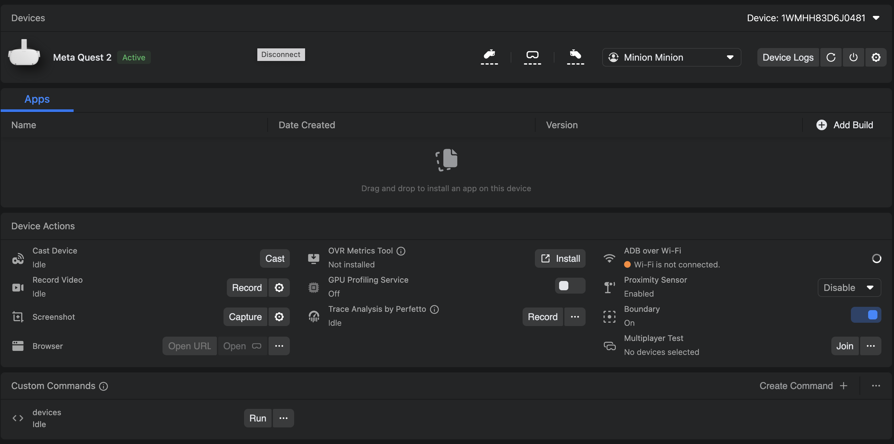

# HO2: XR in Unity

## Objectives
- Install the [XR Interaction Toolkit](https://docs.unity3d.com/Packages/com.unity.xr.interaction.toolkit@3.0/manual/index.html) in a Unity project
- Play your VR game through the `XR Device Simulator`
- Set up your headset
- Build and upload your game to your headset

## Set up a project for VR
Unity provides the [XR Interaction Toolkit](https://docs.unity3d.com/Packages/com.unity.xr.interaction.toolkit@3.0/manual/index.html) to help programmers making XR games, specifically VR games in our case.

**If you have any questions, remember to check the online documentation first.**

To install the toolkit in a new project, follow these steps:

### Create a Unity Project
First, create a new **Unity 6** project using the **3D (Built-In Renderer Pipeline)** template  

_Note: Quest 1 has been end of life for a while now, Unity support for it is greatly reduced. From our experience, there are some compatibility issues with the `Universal Renderer Pipeline` (`URP`). It is possible to use it but highly instable. If you are given a Quest 1, we highly recommend that you only use the basic features of URP. No such issues should occur on Quest 2._ 

### Install the required packages
Then, install the required **packages** (`Window > Package Manager > Unity Registry > <package_name> > Install`)
- **`Universal RP`**
- **`XR Interaction Toolkit`**  
  Install the **`XR Device Simulator`** and **`Starter Assets`** samples as well (`Window > Package Manager > In Project > XR Interaction Toolkit > Samples`)
- **`XR Plugin Management`**
- **`OpenXR Plugin`**

To make sure every package is correctly installed, go to `Window > Package Manager > In Project` and make sure each of them appear in the list:

### Set up settings
- Enable **`OpenXR` Plug-in Provider** (`Edit > Project Settings > XR Plug-in Management`, tick `OpenXR` under each tab)
- Enable `OpenXR` **`Meta Quest Support`** 
  - `Edit > Project Settings > XR Plug-in Management > OpenXR > (android tab) > OpenXR Feature Groups`, tick `Meta Quest Support`
  - Select the correct **target device** (Quest or Quest 2) `Edit > Project Settings > XR Plug-in Management > OpenXR > OpenXR Feature Groups > Meta Quest Support`, click on the cog and tick the correct device under `Target Devices`
- Enable the **`Oculus Touch Controller Profile`** (`Edit > Project Settings > XR Plug-in Management > OpenXR > Enabled Interactions Profiles > + > Oculus Touch Controller Profile`, for each tab)
- **Fix all issues** under **Project Validation** (`Edit > Project Settings > XR Plug-in Management > Project Validation > Fix all`, for each tab)
- Switch the **build platform** to **Android** (`File > Build Profiles > Platforms > Android > Switch Platform`)
- Change the active input system to the newest system (`Project Settings > Player > Active Input Handling > Input System Package (New)`)

You will find a [concise version of this tutorial (`unity_setup.md`)](../resources/unity_setup.md) in the `resources` folder.

## Play the demo on your computer
Play the **`DemoScene`** (`Assets > Samples > XR Interaction Toolkit > {version} > Starter Assets > DemoScene`) on your computer using the **`XR Device Simulator`**. To enable the XR Device Simulator, tick: `Edit > Project settings > XR Plug-in Management > XR Interaction Toolkit > Use XR Device Simulator in scenes`

## Set up your headset (one per team)
The headset you received have been pre-configured. We recommend installing the Meta Quest Developer Hub to ease up the process of uploading a game to the headset. Unfortunately, we can't use two different accounts for the headset and the Meta Quest Developer Hub app anymore.

To solve this issue, you will have to do a complete setup of your headset using your own developer account:

1. **[Factory reset](https://www.meta.com/en-gb/help/quest/149134797159340/?srsltid=AfmBOoqvSr1Xfl1gVLi0ym_ZYmGVjP7r6uc3kC5AiUUK_loCoxcRUJBN)** (Meta Quest section) your headset to make sure it is in a fresh and bugless state
2. You will be required to download the **[Meta Horizon mobile app](https://www.meta.com/en-gb/help/quest/1178714089211378/?srsltid=AfmBOopCjP2kEATXsZQNsOQzn1nrq4BV6ToW7gt-6hrUyijWqWQGLoet)**. (one per team)
3. **Pair the HMD to the Meta Horizon mobile app**:   
In the app select `Menu > Devices > Connect new device` (scroll down the list to see the option) then follow the instructions. It will ask to pair the headset with a Wi-Fi and will proceed to update the headset.
4. **[Enable the developer settings on your headset](https://developers.meta.com/horizon/documentation/native/android/mobile-device-setup/)**:  
In the Meta Horizon mobile app select the headset then `Headset Settings > Developer Mode >` toggle on the button.  
Confirm the developer mode is enabled for your headset: 
   - **Quest 1**: `Quick Settings > Settings > System > Developer` 
   - **Quest 2**: `Advanced -> Developer section`
1. Please also allow the hand tracking feature (under `Movement Tracking`) if you plan on using it.
2. You should then be able to [set up a new device in the MQDH app](https://developers.meta.com/horizon/documentation/native/android/ts-odh-device-setup/).

_If your local machine runs on Windows, you can use [Link](https://www.meta.com/en-gb/help/quest/articles/headsets-and-accessories/oculus-link/connect-with-air-link/) to avoid building your game every time you want to test it. However, we will not provide any support._

You should now see a screen similar to this one: 

_Remember the **`Apps`** panel. This is where you'll upload your game._

## Build your game
**Build** the **`.apk`** file of your application to upload it on your headset:

- Make sure all **issues are fixed** under `Edit > Project Settings > XR Plugin Management > Project validation`
- Make sure the build **target platform** is set to **Android** (`File > Build Profiles > Platforms/Android`)
- Make sure the scene you want to build is in your **build scene list**: `File > Build Profiles > Platforms/Android > Scene List`. Add the **`DemoScene`** in the list and remove any other scenes.
- Click on **`Build`** to create the **`.apk`** file of your game  
  _Tip: Save all your builds under `Builds` for a cleaner project structure_  
  _Note: Optionally, you can use `Build And Run` to directly upload to your headset if connected._  

A popup indicating "Unsupported Input Handling" may appear. Click `No` and set `Edit > Project Settings > Player > Active Input Handling > Input System Package (New)`. This will restart your editor.

## Upload your game to the headset 
Now, you need to upload the **`.apk`** file to the headset.

- Open **`Meta Quest Developer Hub`**
- Connect your headset to your computer via USB-C
  - In the headset, you will be prompted to allow connections coming from this computer. Allow them.
- Drag and drop your **`.apk`** file to the dedicated area
- Then click on the three dots and **`Launch app`**. Your app should launch directly in the headset. 
